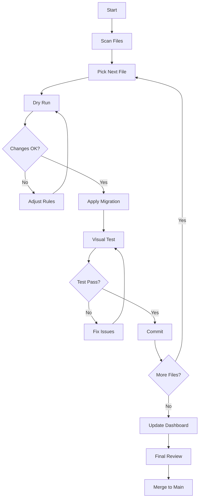

# 🛠️ دليل استخدام أدوات Migration

> أدوات مساعدة لتسريع عملية تطبيق Design Tokens

---

## 📋 جدول المحتويات

1. [الأوامر المتاحة](#الأوامر-المتاحة)
2. [Migration CLI Tool](#migration-cli-tool)
3. [Migration Dashboard](#migration-dashboard)
4. [Visual Regression Testing](#visual-regression-testing)
5. [أمثلة عملية](#أمثلة-عملية)

---

## 🚀 الأوامر المتاحة

### إضافة هذه الأوامر إلى package.json:

```json
{
  "scripts": {
    "migrate:tokens": "ts-node scripts/migrate-tokens-example.ts",
    "migrate:scan": "ts-node scripts/migrate-tokens-example.ts --scan",
    "migrate:dry-run": "ts-node scripts/migrate-tokens-example.ts --dry-run",
    "migration:dashboard": "ts-node scripts/migration-dashboard.ts",
    "test:visual": "playwright test tests/visual-regression",
    "test:visual:update": "playwright test tests/visual-regression --update-snapshots"
  }
}
```

### تثبيت المتطلبات:

```bash
npm install -D ts-node ts-morph chalk ora
npm install -D @playwright/test playwright-chromium
npx playwright install chromium
```

---

## 🔧 Migration CLI Tool

### الاستخدام الأساسي:

#### 1. مسح ملف واحد (Scan)
```bash
npm run migrate:tokens src/components/PaymentHistoryItem.tsx
```

**النتيجة:**
```
🚀 Design Tokens Migration Tool

Processing PaymentHistoryItem.tsx...
✅ Migrated PaymentHistoryItem.tsx (12 changes)

═══════════════════════════════════════════════════════════
  📊 Design Tokens Migration Report
═══════════════════════════════════════════════════════════

📈 Statistics:
  Files scanned:    1
  Files modified:   1
  Replacements:     12
  Duration:         2.34s

✅ Next Steps:
  1. Review the changes in modified files
  2. Run visual regression tests
  3. Test dark mode switching
  4. Remove .backup files if satisfied
```

#### 2. معاينة التغييرات (Dry Run)
```bash
npm run migrate:dry-run src/components/Button.tsx
```

**لن يُجري أي تغييرات فعلية، فقط يعرض preview**

#### 3. مسح جميع الملفات
```bash
npm run migrate:scan
```

**النتيجة:**
```
Scanning src directory...

Found 127 TypeScript files

📄 src/components/PaymentHistoryItem.tsx
   12 potential migrations

📄 src/features/payments/components/DetailRow.tsx
   8 potential migrations

📄 src/shared/components/common/ServiceCardV2.tsx
   15 potential migrations

📊 Summary: 45 files need migration
```

### التخصيص:

يمكنك تعديل `scripts/migrate-tokens-example.ts` لإضافة قواعد جديدة:

```typescript
const MIGRATION_RULES: MigrationRule[] = [
  {
    pattern: /text-blue-600\s+dark:text-blue-400/g,
    replacement: 'style={{ color: colors.brand.primary }}',
    type: 'style',
    description: 'Brand primary color'
  },
  // أضف قواعدك هنا...
];
```

---

## 📊 Migration Dashboard

### تشغيل Dashboard:

```bash
npm run migration:dashboard
```

### النتيجة:

```
╔════════════════════════════════════════════════════════════╗
║     🎨 Design Tokens Migration Dashboard                  ║
╚════════════════════════════════════════════════════════════╝

📊 Overall Progress:

  ████████████░░░░░░░░░░░░░░░░░░░░░░░░░░░░ 20.0%
  9/45 files completed

📈 Breakdown:

  ✓ Completed:      9 files
  ⋯ In Progress:    2 files
  ○ Pending:       34 files

🎯 By Priority:

  🔴 Priority 1 (High):
     ████████████████░░░░ 60% (6/10)
  🟡 Priority 2 (Medium):
     ████░░░░░░░░░░░░░░░░ 20% (3/15)
  🟢 Priority 3 (Low):
     ░░░░░░░░░░░░░░░░░░░░ 0% (0/20)

📁 By Category:

  ✓ Payment         3/3
  ⋯ Notification    1/2
  ○ Profile         0/2
  ○ Auth            0/2
  ⋯ Academy         2/4
  ○ Shop            0/2
  ○ Trading         0/2
  ○ Common          0/3
  ○ Layout          0/4

🕐 Recent Activity:

  ✓ NotificationItem.tsx
     2025-10-24 01:30:15 - 8 changes
  ✓ PaymentHistoryItem.tsx
     2025-10-24 01:25:42 - 12 changes

⏱️  Time Estimate:

  Remaining files: 36
  Estimated time:  9h 0m
  Last updated:    2025-10-24 01:45:00

📝 Next Steps:

  1. 🔴 DetailRow.tsx
     src/features/payments/components/DetailRow.tsx
  2. 🔴 PaymentCard.tsx
     src/features/payments/components/PaymentCard.tsx
  3. 🔴 NotificationFilter.tsx
     src/features/notifications/components/NotificationFilter.tsx
```

### تحديث Dashboard يدوياً:

Dashboard يحفظ التقدم في `.migration-progress.json`. يمكنك تعديله يدوياً:

```json
{
  "lastUpdated": "2025-10-24T01:45:00.000Z",
  "files": [
    {
      "path": "src/components/PaymentHistoryItem.tsx",
      "status": "completed",
      "priority": 1,
      "category": "Payment",
      "migratedAt": "2025-10-24T01:25:42.000Z",
      "replacements": 12
    }
  ]
}
```

---

## 🧪 Visual Regression Testing

### تشغيل الاختبارات:

```bash
# تشغيل جميع الاختبارات
npm run test:visual

# تشغيل اختبار محدد
npx playwright test tests/visual-regression/components.spec.ts

# تحديث screenshots المرجعية
npm run test:visual:update
```

### بنية الاختبارات:

```typescript
test('Card Components - Light Mode', async ({ page }) => {
  await page.goto('http://localhost:3000');
  await setTheme(page, 'light');
  await page.waitForLoadState('networkidle');
  
  const card = page.locator('[data-testid="service-card"]').first();
  await expect(card).toHaveScreenshot('card-light.png', {
    maxDiffPixels: 100,
  });
});
```

### إضافة اختبارات جديدة:

1. أنشئ ملف في `tests/visual-regression/`
2. استخدم `data-testid` في المكونات
3. اكتب الاختبار
4. شغّل `npm run test:visual:update` أول مرة لإنشاء baseline

### معالجة الاختلافات:

إذا فشل اختبار:

```bash
# عرض الاختلافات
npx playwright show-report

# إذا كانت التغييرات مقصودة، حدّث baseline:
npm run test:visual:update
```

---

## 💡 أمثلة عملية

### مثال 1: Migration مكون واحد

```bash
# 1. معاينة التغييرات
npm run migrate:dry-run src/components/Button.tsx

# 2. إذا كانت التغييرات صحيحة، طبّقها
npm run migrate:tokens src/components/Button.tsx

# 3. راجع التغييرات
git diff src/components/Button.tsx

# 4. اختبر المكون
npm run dev
# افتح المتصفح وراجع Button

# 5. شغّل visual regression test
npm run test:visual

# 6. إذا كل شيء تمام، commit
git add src/components/Button.tsx
git commit -m "feat: migrate Button to design tokens"
```

### مثال 2: Migration دفعة كاملة (Priority 1)

```bash
# 1. اطبع قائمة الملفات
npm run migrate:scan | grep "Priority 1"

# 2. migrate كل ملف
npm run migrate:tokens src/features/payments/components/DetailRow.tsx
npm run migrate:tokens src/features/payments/components/PaymentCard.tsx
npm run migrate:tokens src/features/notifications/components/NotificationFilter.tsx
# ... etc

# 3. شغّل visual regression على كل الصفحات المتأثرة
npm run test:visual

# 4. إذا فشلت بعض الاختبارات، راجعها
npx playwright show-report

# 5. حدّث Dashboard
npm run migration:dashboard

# 6. Commit إذا كل شيء تمام
git add .
git commit -m "feat: migrate Priority 1 components to design tokens"
```

### مثال 3: إصلاح مشكلة بعد Migration

```bash
# 1. اكتشفت مشكلة في Card component
# 2. استرجع الـ backup
cp src/components/Card.tsx.backup src/components/Card.tsx

# 3. راجع ماذا حصل
git diff src/components/Card.tsx.backup src/components/Card.tsx

# 4. أصلح المشكلة يدوياً
code src/components/Card.tsx

# 5. اختبر مرة أخرى
npm run test:visual

# 6. احذف backup إذا كل شيء تمام
rm src/components/Card.tsx.backup
```

---

## 🔍 Troubleshooting

### المشكلة: "Cannot find module 'ts-morph'"

**الحل:**
```bash
npm install -D ts-morph
```

### المشكلة: "Playwright browser not installed"

**الحل:**
```bash
npx playwright install chromium
```

### المشكلة: "Migration tool doesn't detect patterns"

**الحل:**
```typescript
// في migrate-tokens-example.ts، تأكد أن regex صحيح:
const pattern = /text-gray-900\s+dark:text-white/g;
// ملاحظة: \s+ يعني مسافة أو أكثر
```

### المشكلة: "Visual regression tests always fail"

**الحل:**
```bash
# حدّث baseline screenshots
npm run test:visual:update

# أو زد threshold:
await expect(card).toHaveScreenshot('card.png', {
  maxDiffPixels: 200, // بدلاً من 100
});
```

---

## 📝 Best Practices

### 1. قبل Migration:

- ✅ Commit كل التغييرات الحالية
- ✅ أنشئ branch جديد: `git checkout -b feature/design-tokens-migration`
- ✅ شغّل tests الموجودة للتأكد أن كل شيء يعمل

### 2. أثناء Migration:

- ✅ Migrate ملف واحد في المرة
- ✅ اختبر بعد كل ملف
- ✅ Commit بعد كل ملف ناجح
- ✅ استخدم commit messages واضحة

### 3. بعد Migration:

- ✅ شغّل visual regression tests
- ✅ اختبر dark mode switching
- ✅ اختبر responsive على أحجام شاشات مختلفة
- ✅ احذف backup files
- ✅ حدّث documentation

---

## 🎯 Workflow المقترح



---

## 📚 المراجع

- **Migration Tool:** `scripts/migrate-tokens-example.ts`
- **Dashboard:** `scripts/migration-dashboard.ts`
- **Visual Tests:** `tests/visual-regression/`
- **Design Tokens:** `src/styles/tokens/`
- **Migration Guide:** `docs/DESIGN_TOKENS_MIGRATION.md`

---

**آخر تحديث:** 24 أكتوبر 2025  
**الحالة:** جاهز للاستخدام ✅
